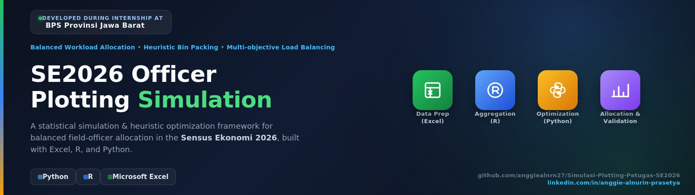
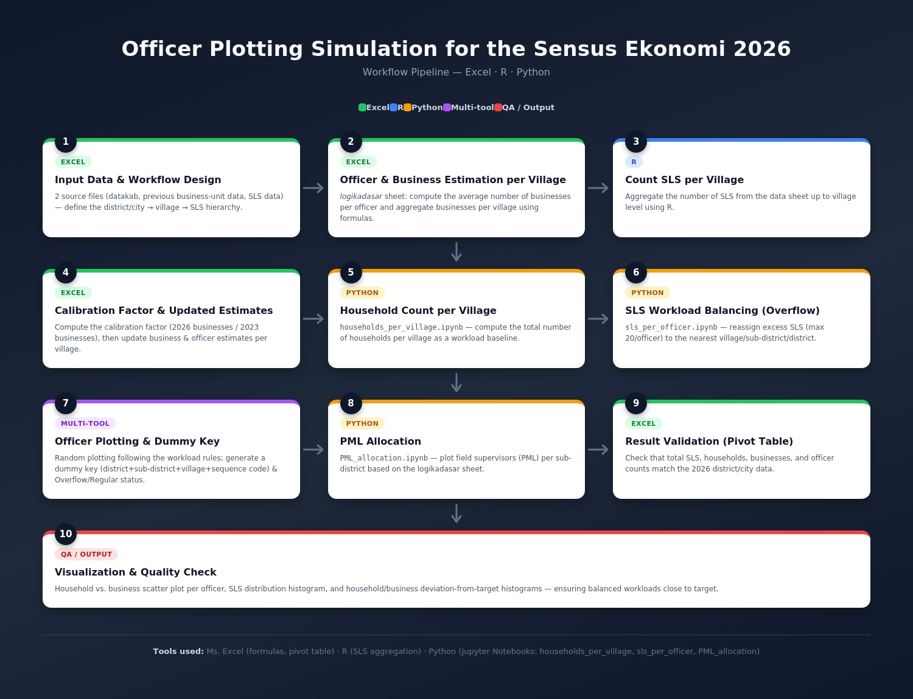

<p align="center">
  
</p>

<p align="center">


</p>

<p align="center">
A statistical simulation and heuristic optimization framework for balanced field officer allocation in the Sensus Ekonomi 2026 (SE2026).
</p>

---

# Overview

This repository presents a simulation framework for allocating field officers in the **2026 Economic Census (SE2026)** conducted by **Statistics Indonesia (BPS)**.

The objective is to distribute census officers across **Satuan Lingkungan Setempat (SLS)** while maintaining a balanced workload based on multiple operational indicators, including:

- Number of SLS
- Number of households
- Estimated business units

The allocation process combines several statistical and optimization approaches:

- **Balanced Workload Allocation**
- **Heuristic Bin Packing**
- **Multi-objective Load Balancing**
- **Constraint-based Resource Allocation**

The workflow integrates **Microsoft Excel**, **R**, and **Python** for data preprocessing, workload estimation, workload balancing, officer allocation, validation, and visualization.

> **Disclaimer**
>
> This repository is intended solely for educational and portfolio purposes.
>
> The original datasets used during my internship at **Statistics Indonesia (BPS)** are confidential and are **not included** in this repository. Any data provided in this repository are sample or synthetic data created for demonstration purposes only.

---

# Project Highlights

- Developed a simulation framework for SE2026 field officer allocation.
- Estimated officer requirements at the village level.
- Applied heuristic optimization to balance workloads.
- Simulated officer and supervisor (PML) assignments.
- Evaluated allocation quality using statistical visualization.
- Implemented using Microsoft Excel, Python, and R.

---

# Objectives

This project aims to:

- Estimate the required number of census officers for each village.
- Calculate household totals at the village level.
- Allocate SLS while satisfying operational constraints.
- Balance workloads using multiple workload indicators.
- Simulate officer assignments.
- Allocate Field Supervisors (PML).
- Evaluate allocation quality through statistical visualization.

---

# Methodology

## Statistical Methodology

The statistical components include:

- Data aggregation
- Household aggregation
- Business unit estimation
- Ratio estimation
- Calibration factor adjustment
- Descriptive statistical analysis
- Distribution analysis
- Workload deviation analysis

---

## Optimization Methodology

The allocation process combines several optimization techniques:

- Balanced Workload Allocation
- Heuristic Bin Packing
- Multi-objective Load Balancing
- Constraint-based Resource Allocation
- Neighbor-based workload transfer
- Randomized officer assignment

---

## Data Science Perspective

Although this project does **not train predictive machine learning models**, it applies several important data science principles:

- Data preprocessing
- Feature engineering
- Rule-based optimization
- Constraint optimization
- Resource allocation
- Operational simulation
- Decision support system development
- Statistical performance evaluation
- Data visualization

---

# Workflow

The following diagram illustrates the complete workflow for estimating workloads, balancing assignments, allocating field officers, and validating the final results.

<p align="center">
  
</p>

---

# Repository Structure

```text
SE2026-Officer-Plotting/
│
├── README.md
├── requirements.txt
├── notebook/
│   ├── Load_Data.ipynb
│   ├── PML_allocation.ipynb
│   ├── households_per_village.ipynb
│   └── sls_per_officer.ipynb
│
├── images/
│   ├── banner.jpg
│   ├── example_deviasi kk target.png
│   ├── example_deviasi kk usaha petugas.png
│   ├── example_deviasi usaha target.png
│   ├── example_dist sls.png
│   ├── example_kk vs usaha.png
│   └── workflow_diagram.jpg
└── sls_calculate.R

```

---

# Project Components

| Notebook | Description |
|-----------|-------------|
| Load_Data.ipynb | Import, clean, and prepare the source datasets for workload estimation. |
| PML_allocation.ipynb | Allocate Field Supervisors (PML). |
| households_per_village.ipynb | Calculate household totals for each village. |
| sls_per_officer.ipynb | Calculate and balance SLS workload per officer. |

---

# Technologies

| Tool | Purpose |
|------|---------|
| Microsoft Excel | Initial data preparation |
| Python | Data processing, simulation, workload balancing, visualization |
| R | Village-level aggregation |

### Python Libraries

- pandas — data manipulation and analysis
- numpy — numerical computing
- pulp — optimization and workload allocation
- matplotlib — statistical visualization
- tqdm — progress monitoring

---

# Business Rules

The allocation process follows several operational rules:

- Maximum **20 SLS** per officer.
- Workloads are balanced according to:
  - Number of households
  - Estimated business units
  - Number of SLS
- SLS with **0 households** and **0 business units** are excluded.
- Excess workloads are transferred to neighboring villages whenever possible.
- If necessary, transfers continue across neighboring subdistricts and districts.

---

# Validation

The allocation results are evaluated using:

- Officer count consistency
- SLS consistency
- Household consistency
- Business unit consistency
- Maximum workload compliance
- Workload balance assessment

---

# Visualization

The project generates several visualizations for workload evaluation.

### Household vs Business Units

<p align="center">
  
</p>

This scatter plot illustrates the relationship between the number of households and the estimated number of business units assigned to each officer.

---

### SLS Distribution

<p align="center">
  
</p>

Histogram showing the distribution of SLS assigned to each field officer.

---

### Household Deviation from Target

<p align="center">
  
</p>

Distribution of household workload deviations relative to the target workload.

---

### Business Unit Deviation from Target

<p align="center">
  
</p>

Distribution of estimated business-unit deviations from the target allocation.

---

### Household vs Business Unit Deviation

<p align="center">
  
</p>

Scatter plot comparing household and business-unit deviations across field officers.

---

# Output

The workflow produces:

- Officer allocation results
- PML allocation
- Household summaries
- Business unit estimation
- SLS allocation
- Validation report
- Statistical visualizations

---

# Skills Demonstrated

This project demonstrates practical experience in:

- Statistical Analysis
- Data Aggregation
- Data Cleaning
- Data Preprocessing
- Workload Estimation
- Resource Allocation
- Heuristic Optimization
- Constraint-based Optimization
- Simulation Modeling
- Decision Support Systems
- Python Programming
- R Programming
- Microsoft Excel
- Data Visualization

---


# License

This repository is intended for educational and portfolio purposes only.

The original implementation was developed during an internship at **Statistics Indonesia (BPS)**. Confidential information and original datasets have been removed before publication.

---

# Acknowledgement

This project was developed during my internship at **Statistics Indonesia (BPS) – West Java Province** as part of the preparation for the **2026 Economic Census (SE2026)**.

The published version has been adapted for portfolio purposes by replacing confidential information with sample or synthetic data while preserving the overall analytical workflow.

---

# Connect with Me

If you'd like to discuss this project or explore collaboration opportunities, feel free to connect with me.

[](https://www.linkedin.com/in/anggie-alnurin-prasetya)

[](https://medium.com/@anggiealnurin27)